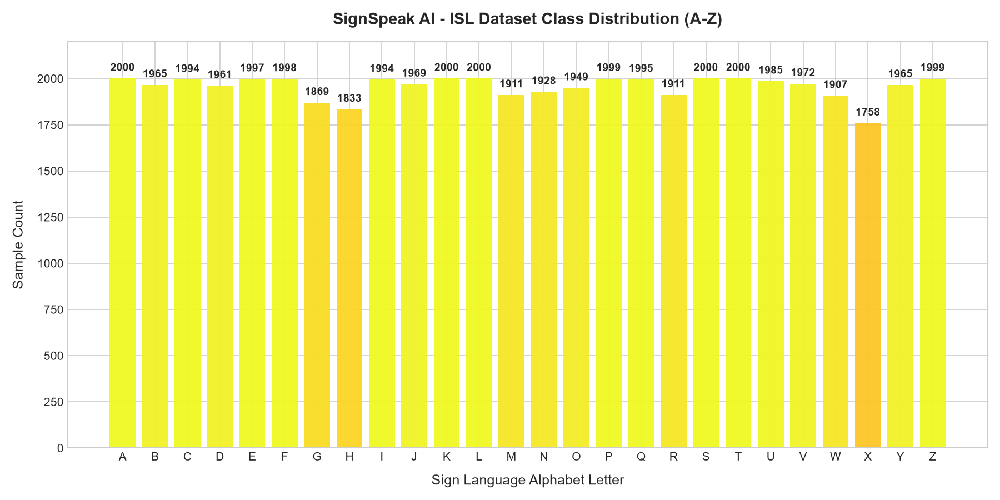
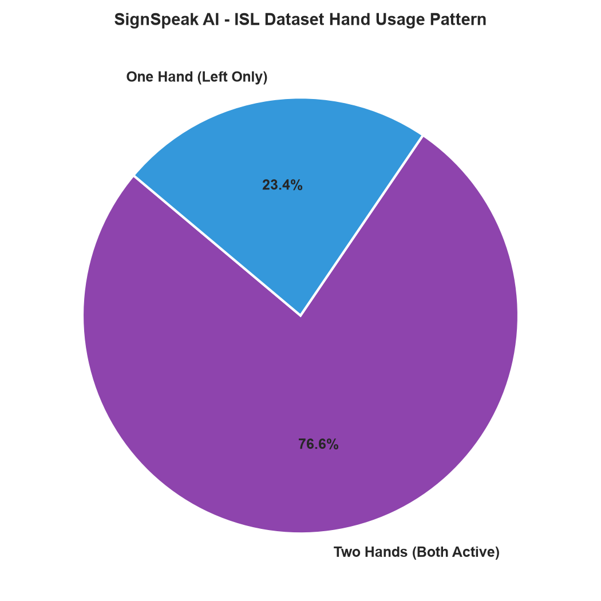
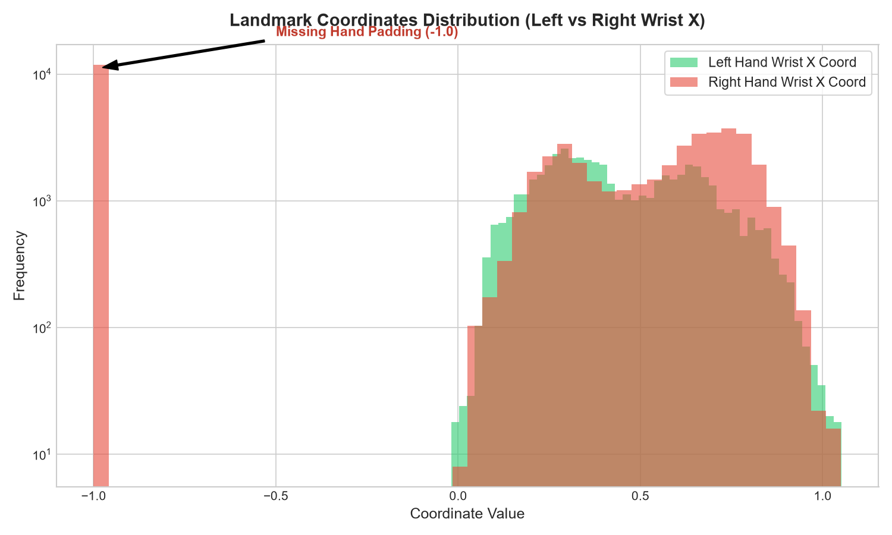

# Indian Sign Language Landmark Dataset Analysis

This report documents the exploration, validation, and visual analysis of the Indian Sign Language (ISL) Hand Landmarks dataset.

## 1. Summary Statistics

The dataset was loaded and analyzed from `dataset/Indian Sign Language Gesture Landmarks.csv`.

| Metric | Value | Details |
|---|---|---|
| **Total Samples** | 50,859 | High-density representation for reliable neural network training. |
| **Total Columns** | 128 | 1 Target class + 1 hand flag + 126 coordinate features. |
| **Feature Count** | 127 | `uses_two_hands` (1) + Left Hand (63) + Right Hand (63). |
| **Missing (Null) Values** | 0 | Clean dataset with no missing records or NaN values. |
| **Duplicate Rows** | 0 | No redundant rows identified. |
| **Data Types** | `float64` (127), `int64` (1) | Coordinates and flag are floats, the target class index is an integer. |

---

## 2. Schema Verification

The dataset conforms exactly to the expected schema needed for dual-hand inference:

*   **`target` (1 column)**: Integer representing the target alphabet class index (0-25).
*   **`uses_two_hands` (1 column)**: Binary float flag (`1.0` if both hands are present, `0.0` if only one hand is present).
*   **`left_hand_*` (63 columns)**: Coordinates `left_hand_x_0` to `left_hand_z_20` representing the 21 MediaPipe hand landmarks (x, y, z) for the left hand.
*   **`right_hand_*` (63 columns)**: Coordinates `right_hand_x_0` to `right_hand_z_20` representing the 21 MediaPipe hand landmarks (x, y, z) for the right hand.

---

## 3. Hand Usage Distribution

In Sign Language, gestures can be one-handed or two-handed. The distribution in the dataset is as follows:

*   **Two Hands (Both Active)**: 38,965 samples (**76.61%**)
*   **One Hand (Left Only)**: 11,894 samples (**23.39%**)

> [!NOTE]
> For single-handed gestures (where `uses_two_hands` is `0.0`), all 63 coordinates of the `right_hand` features are padded with `-1.0` values. The `left_hand` coordinates contain the active hand landmarks.

---

## 4. Class Distribution (A-Z)

The dataset is highly balanced across all 26 alphabet classes (A to Z), which prevents model bias towards specific letters during training:

| Class Index | Letter | Sample Count | Percentage |
| :---: | :---: | :---: | :---: |
| **0** | **A** | 2000 | 3.93% |
| **1** | **B** | 1965 | 3.86% |
| **2** | **C** | 1994 | 3.92% |
| **3** | **D** | 1961 | 3.86% |
| **4** | **E** | 1997 | 3.93% |
| **5** | **F** | 1998 | 3.93% |
| **6** | **G** | 1869 | 3.67% |
| **7** | **H** | 1833 | 3.60% |
| **8** | **I** | 1994 | 3.92% |
| **9** | **J** | 1969 | 3.87% |
| **10** | **K** | 2000 | 3.93% |
| **11** | **L** | 2000 | 3.93% |
| **12** | **M** | 1911 | 3.76% |
| **13** | **N** | 1928 | 3.79% |
| **14** | **O** | 1949 | 3.83% |
| **15** | **P** | 1999 | 3.93% |
| **16** | **Q** | 1995 | 3.92% |
| **17** | **R** | 1911 | 3.76% |
| **18** | **S** | 2000 | 3.93% |
| **19** | **T** | 2000 | 3.93% |
| **20** | **U** | 1985 | 3.90% |
| **21** | **V** | 1972 | 3.88% |
| **22** | **W** | 1907 | 3.75% |
| **23** | **X** | 1758 | 3.46% |
| **24** | **Y** | 1965 | 3.86% |
| **25** | **Z** | 1999 | 3.93% |

---

## 5. Visualizations

The following plots were generated and saved in the `ml/artifacts/` directory for reference during the project defense:

### Class Distribution (A-Z)
The uniform height across all bins indicates a highly balanced representation of sign characters:

### Hand Usage Pattern
The relative breakdown between single-hand and dual-hand gestures in the dataset:

### Landmark Coordinate Values (Left vs. Right Wrist X)
This histogram highlights the `-1.0` padding used for the right hand when missing, compared to standard spatial distributions of active hands:

