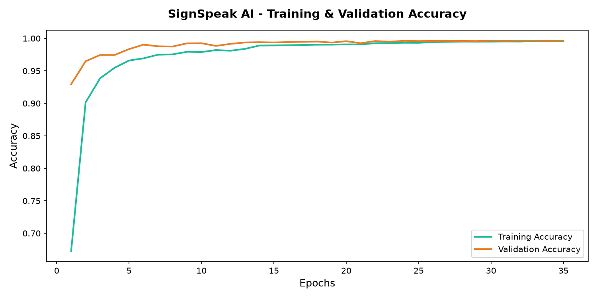
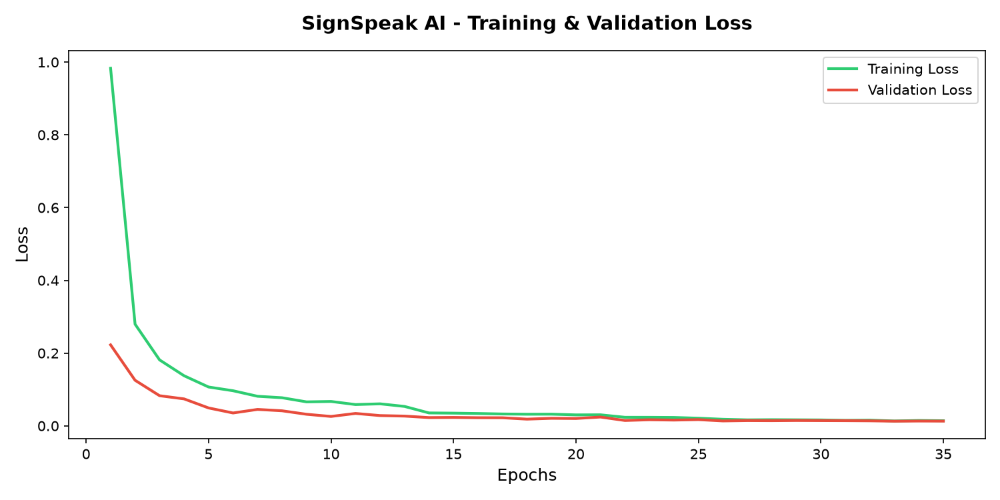
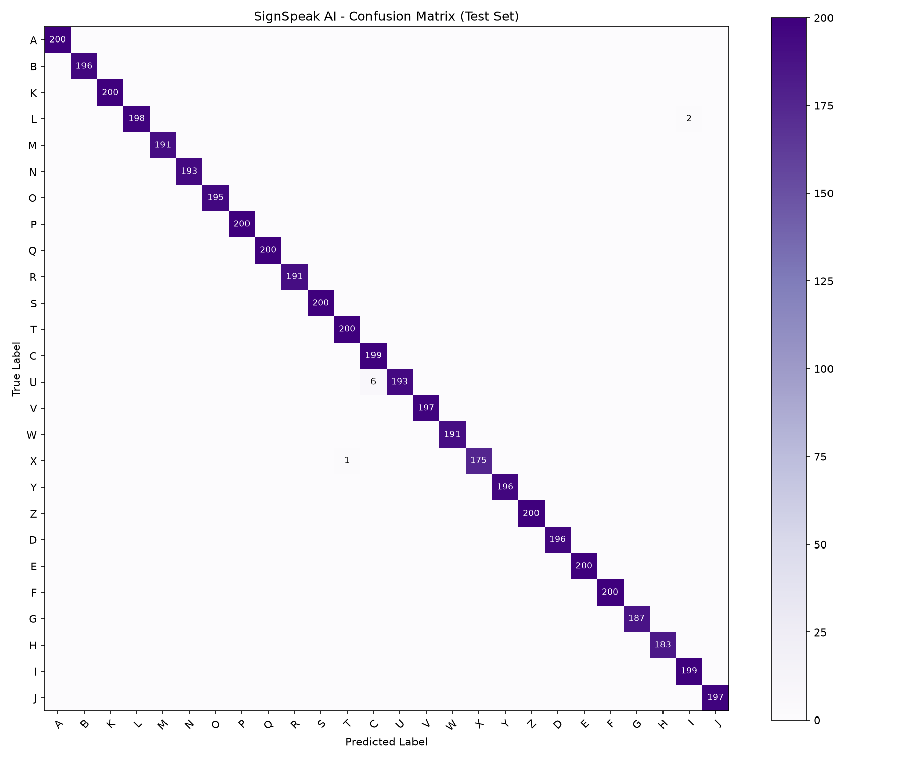

# Model Architecture Documentation

This document describes the MLP neural network configurations, training details, callback strategies, and final performance metrics for the SignSpeak AI gesture translation model.

---

## 1. Model Selection & Rationale

To identify the optimal configuration for mapping a 127-value hand landmark vector to 26 alphabet classes (A-Z), we trained and compared three Multi-Layer Perceptron (MLP) architectures of increasing complexity:

| Architecture | Layer Layout | Total Parameters | Validation Accuracy | Status |
|---|---|:---:|:---:|:---:|
| **Model A (Simple)** | `Input(127) -> Dense(64) -> Dropout(0.1) -> Dense(32) -> Dense(26)` | 11,226 | 96.89% | Candidate |
| **Model B (Medium)** | `Input(127) -> Dense(128) -> Dropout(0.2) -> Dense(64) -> Dropout(0.2) -> Dense(32) -> Dense(26)` | 27,898 | 99.41% | Candidate |
| **Model C (Complex)** | `Input(127) -> Dense(256) -> Dropout(0.2) -> Dense(128) -> Dropout(0.2) -> Dense(64) -> Dropout(0.2) -> Dense(32) -> Dense(26)` | **78,074** | **99.49%** | **Winner (Selected)** |

### Rationale
*   **Capacity**: Model C has the capacity to extract high-order geometric relationships (angles and ratios) between the coordinates of both hands.
*   **Overfitting Protection**: Despite having 78,074 parameters, Model C did not experience overfitting because Dropout layers (rate: 0.2) were inserted between each dense hidden layer to break co-dependencies, and the dataset is large and balanced (~40,000 training samples).
*   **Convergence**: Model C achieved the lowest validation loss and highest validation accuracy. It was trained to full convergence using an early stopping callback.

---

## 2. Final Selected Model Layout

Model C (Complex) is structured as follows:

```text
Input (127 features)
   │
   ├── Dense (256 neurons, ReLU activation)
   ├── Dropout (0.2 drop rate)
   │
   ├── Dense (128 neurons, ReLU activation)
   ├── Dropout (0.2 drop rate)
   │
   ├── Dense (64 neurons, ReLU activation)
   ├── Dropout (0.2 drop rate)
   │
   ├── Dense (32 neurons, ReLU activation)
   │
   └── Dense (26 neurons, Softmax activation) [Output Layer]
```

*   **Total parameters**: 78,074 (all trainable).
*   **Loss function**: Sparse Categorical Crossentropy.
*   **Optimizer**: Adam (initial learning rate = 0.001).

---

## 3. Callback Configuration

The training pipeline implemented three standard callbacks to regulate learning:

1.  **EarlyStopping**:
    *   `monitor='val_loss'`, `patience=8`, `restore_best_weights=True`
    *   Terminated training early when validation loss stopped improving, restoring weights to the optimal run to prevent overfitting.
2.  **ModelCheckpoint**:
    *   `monitor='val_loss'`, `save_best_only=True`
    *   Saved the best weights to `sign_speak_model.keras`.
3.  **ReduceLROnPlateau**:
    *   `monitor='val_loss'`, `factor=0.5`, `patience=3`, `min_lr=1e-6`
    *   Scaled down the learning rate by half when validation loss plateaued, enabling fine-grained weight updates during final convergence.

---

## 4. Training History Visualizations

The training process converged quickly. The learning curves show smooth minimization of loss and fast learning rate adjustments:

### Accuracy Curve


### Loss Curve


---

## 5. Evaluation Metrics on Unseen Test Set

Model evaluation on the test split (10% of total data = 5,086 samples) yielded outstanding results:

*   **Test Accuracy**: **99.82%**
*   **Weighted Precision**: **0.9983**
*   **Weighted Recall**: **0.9982**
*   **Weighted F1 Score**: **0.9982**

### Confusion Matrix
The diagonal line highlights the minimal misclassifications on the test set:

